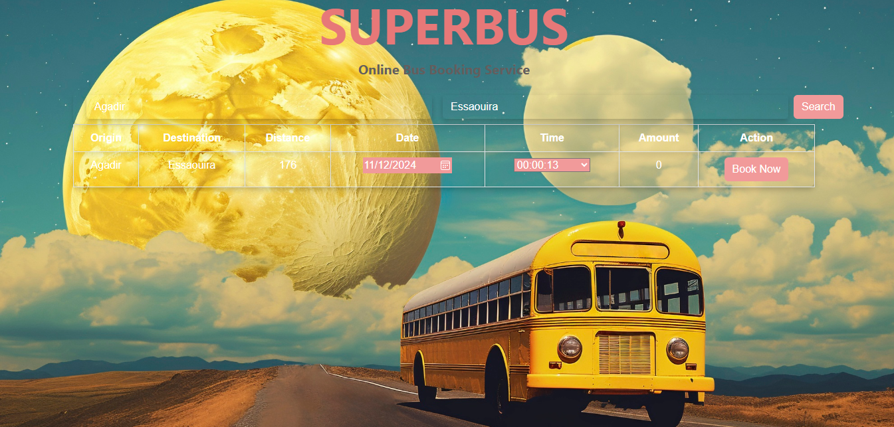
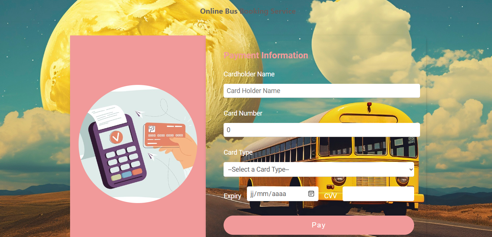
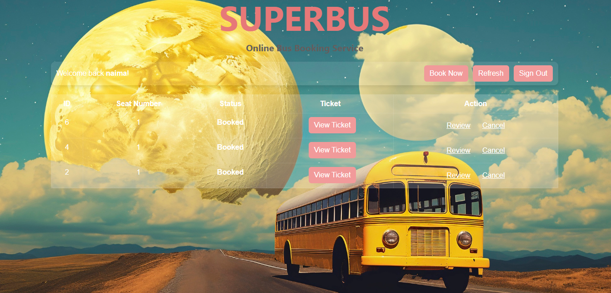

# Système de Réservation de Billets de Bus en Ligne

## Description

Le Système de Réservation de Billets de Bus en Ligne est une application web conçue pour faciliter la réservation de billets de bus. Il offre aux utilisateurs une interface intuitive pour s'inscrire, se connecter, consulter les itinéraires de bus disponibles, réserver des billets et gérer leurs réservations. Le système est construit en utilisant Angular pour le frontend et une architecture de MVC pour le backend, garantissant évolutivité, sécurité et disponibilité.

## Objectif

L'objectif principal de ce projet est de fournir une plateforme fluide et efficace pour que les utilisateurs puissent réserver des billets de bus en ligne. Le système vise à simplifier le processus de réservation, gérer les horaires, traiter les paiements et fournir des informations détaillées sur les itinéraires de bus.

## Captures d'Écran

Voici quelques captures d'écran du Système de Réservation de Billets de Bus en Ligne :

### Page de Connexion


### Page d'Accueil


### Page de Réservation


### Pages de Paiement




### Page de review


### Page de tickets



## Fonctionnalités

### Gestion des Utilisateurs
- **Inscription**: Les utilisateurs peuvent créer un nouveau compte.
- **Connexion**: Les utilisateurs peuvent se connecter à leur compte.
- **Gestion du Profil**: Les utilisateurs peuvent consulter et mettre à jour les informations de leur profil.

### Gestion des Réservations
- **Créer une Réservation**: Les utilisateurs peuvent réserver un billet de bus.
- **Voir les Réservations**: Les utilisateurs peuvent consulter les détails de leurs réservations.
- **Annuler une Réservation**: Les utilisateurs peuvent annuler leurs réservations.
- **Évaluer une Réservation**: Les utilisateurs peuvent évaluer leurs réservations passées.

### Gestion des Horaires
- **Voir les Horaires**: Les utilisateurs peuvent consulter les horaires de bus disponibles.
- **Créer un Horaire**: Les administrateurs peuvent créer de nouveaux horaires de bus.
- **Mettre à Jour un Horaire**: Les administrateurs peuvent mettre à jour les horaires existants.

### Traitement des Paiements
- **Effectuer un Paiement**: Les utilisateurs peuvent effectuer des paiements pour leurs réservations.
- **Voir les Paiements**: Les utilisateurs peuvent consulter leur historique de paiements.

### Gestion des Itinéraires
- **Voir les Itinéraires**: Les utilisateurs peuvent consulter les itinéraires de bus disponibles.
- **Ajouter un Itinéraire**: Les administrateurs peuvent ajouter de nouveaux itinéraires de bus.
- **Mettre à Jour un Itinéraire**: Les administrateurs peuvent mettre à jour les itinéraires existants.

## Architecture du Système

### Composants

- **Service Utilisateur**: Gère les comptes utilisateurs, y compris la connexion, l'inscription et la gestion du profil.
- **Service de Réservation**: Gère les réservations, y compris la création, la récupération, l'annulation et l'évaluation des réservations.
- **Service des Horaires**: Gère les horaires, y compris la récupération, la création et la mise à jour des horaires.
- **Service de Paiement**: Traite les paiements pour les réservations.
- **Service des Itinéraires**: Fournit des informations sur les itinéraires de bus, y compris l'origine, la destination, la durée et le montant.

### Interactions

- L'utilisateur interagit avec l'interface utilisateur pour se connecter, consulter ses réservations et réserver un nouveau bus.
- Le service utilisateur récupère le compte utilisateur depuis la base de données.
- Le service de réservation récupère la réservation de l'utilisateur depuis la base de données ou crée une nouvelle réservation si elle n'existe pas.
- Le service des horaires récupère l'horaire depuis la base de données ou crée un nouvel horaire si celui-ci n'existe pas.
- Le service de paiement traite le paiement pour la réservation.
- Les API d'évaluation et d'annulation sont gérées par le service de réservation.
- Le billet est généré par le service des horaires et le service des itinéraires.

### Considérations

- **Sécurité**: Le système doit être sécurisé pour protéger les données des utilisateurs.
- **Évolutivité**: Le système doit être évolutif pour gérer un grand nombre d'utilisateurs.
- **Disponibilité**: Le système doit être disponible pour les utilisateurs 24/7.

## Commandes

### Démarrer le Front
Exécutez `npm start` pour lancer le projet. Accédez à `http://localhost:4200/`.

### Démarrer le Backend
Pour démarrer le backend, assurez-vous d'abord que vous avez configuré votre environnement Java et MySQL. Ensuite, exécutez les commandes suivantes :

1. Ouvrez Eclipse et importez le projet Spring Boot :
    - Allez dans `File` > `Import`.
    - Sélectionnez `Maven` > `Existing Maven Projects` et cliquez sur `Next`.
    - Parcourez le répertoire du projet et cliquez sur `Finish`.


2. Changez le mot de passe de l'utilisateur root de MySQL :
    ```sql
    ALTER USER 'root'@'localhost' IDENTIFIED BY 'password';
    FLUSH PRIVILEGES;
    ```

3. Créez la base de données et insérez les données initiales :
    ```sql
    CREATE DATABASE training;
    USE training;

    INSERT INTO bus_route (route_id, destination, origin, distance, duration, available_seats)
    VALUES (107, 'Casablanca', 'Rabat', 95, '01:30:00', 30),
           (109, 'Marrakech', 'Casablanca', 240, '03:30:00', 30),
           (110, 'Fès', 'Marrakech', 530, '07:00:00', 30),
           (112, 'Rabat', 'Casablanca', 95, '01:30:00', 30),
           (113, 'Casablanca', 'Marrakech', 240, '03:30:00', 30),
           (115, 'Marrakech', 'Fès', 530, '07:00:00', 30);

    INSERT INTO route_fare (fare_id, basic_cost, cost_per_km)
    VALUES (1, 50, 0.5);

    INSERT INTO route_slot (slot_id, slot)
    VALUES (1, '10:00:00'),
           (2, '12:00:00'),
           (3, '14:00:00'),
           (4, '16:00:00'),
           (5, '18:00:00');
    ```

3. Démarrez le serveur Spring Boot :
    - Faites un clic droit sur le projet dans l'explorateur de projets.
    - Sélectionnez `Run As` > `Spring Boot App`.


## Modèle de Données

### Utilisateur
| Champ     | Type    | Description               |
|-----------|---------|---------------------------|
| id        | integer | Clé primaire              |
| name      | varchar | Nom de l'utilisateur      |
| email     | varchar | Email de l'utilisateur    |
| password  | varchar | Mot de passe de l'utilisateur |

### Réservation
| Champ       | Type    | Description                        |
|-------------|---------|------------------------------------|
| id          | integer | Clé primaire                       |
| user_id     | integer | Clé étrangère vers Utilisateur.id  |
| schedule_id | integer | Clé étrangère vers BusSchedule.id  |
| status      | varchar | Statut de la réservation           |

### Évaluation
| Champ     | Type    | Description                        |
|-----------|---------|------------------------------------|
| id        | integer | Clé primaire                       |
| user_id   | integer | Clé étrangère vers Utilisateur.id  |
| rating    | integer | Note de l'évaluation               |
| comment   | varchar | Commentaire de l'évaluation        |

### Annulation
| Champ       | Type    | Description                        |
|-------------|---------|------------------------------------|
| id          | integer | Clé primaire                       |
| booking_id  | integer | Clé étrangère vers Réservation.id  |
| user_id     | integer | Clé étrangère vers Utilisateur.id  |
| reason      | varchar | Raison de l'annulation             |

### Itinéraire de Bus
| Champ           | Type    | Description                        |
|-----------------|---------|------------------------------------|
| id              | integer | Clé primaire                       |
| origin          | varchar | Origine de l'itinéraire            |
| destination     | varchar | Destination de l'itinéraire        |
| distance        | double  | Distance de l'itinéraire           |
| duration        | time    | Durée de l'itinéraire              |
| available_seats | int     | Nombre de sièges disponibles       |

### Horaire de Bus
| Champ           | Type    | Description                        |
|-----------------|---------|------------------------------------|
| id              | integer | Clé primaire                       |
| bus_route_id    | integer | Clé étrangère vers Itinéraire.id   |
| departure_time  | timestamp | Heure de départ                  |
| arrival_time    | timestamp | Heure d'arrivée                  |
| amount          | float   | Montant                            |

### Paiement
| Champ       | Type    | Description                        |
|-------------|---------|------------------------------------|
| id          | integer | Clé primaire                       |
| booking_id  | integer | Clé étrangère vers Réservation.id  |
| amount      | float   | Montant                            |

### Table de Support

#### Tarifs des Itinéraires
| Champ       | Type    | Description                        |
|-------------|---------|------------------------------------|
| fare_id     | integer | Clé primaire                       |
| basic_cost  | double  | Coût de base                       |
| cost_per_km | double  | Coût par kilomètre                 |

#### Créneaux des Itinéraires
| Champ       | Type    | Description                        |
|-------------|---------|------------------------------------|
| slot_id     | integer | Clé primaire                       |
| slot        | timestamp | Créneau horaire                  |

## Outils Utilisés

- **Angular**: Utilisé pour le développement du frontend.
- **Spring Boot**: Utilisé pour le développement du backend.
- **MySQL**: Utilisé pour la gestion de la base de données.
- **Eclipse**: Utilisé pour le développement et l'exécution du backend.
- **JDK**: Utilisé pour exécuter les applications Java.

# Bus_Booking_webapp
